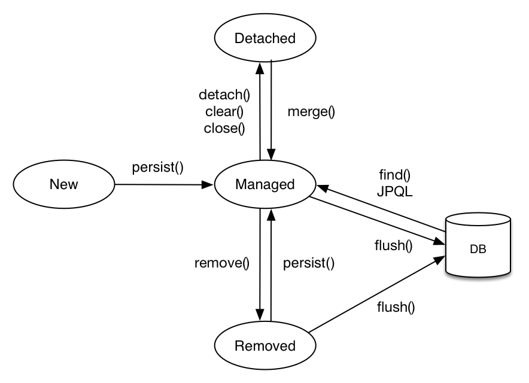

# 1장 

JPA (Java Persistence API)

- Java ORM 기술에 대한 API 표준 명세

- JPA 객체 그래프 탐색 : 지연로딩 이용
  - SQL 기반으로 하려면 미리 모두 쿼리를 만들어두어야 함.
- 동등성 비교
  - == : 인스턴스가 같은가
  - equals : 값이 같은가
  - JPA는 같은 트랜잭션일 때 같은 객체가 조회되는 것을 보장한다. (==)
- 패러다임의 불일치를 해결하기 위한 노력
- Why JPA
  - 생산성 : CRUD
  - 유지보수 : 엔티티 수정이 SQLs의 수정으로 이어지지 않음
  - 패러다임 불일치 해결
  - 성능 : ex> 캐시
  - 데이터 접근 추상화와 벤더 독립성
  - 표준

# 2장

- 영속성 컨텍스트(persistence context)
  - 비영속 : 영속성 컨텍스트와 전혀 관계가 없는 상태
  - 영속 : 영속성 컨텍스트에 저장된 상태
  - 준영속 : 영속성 컨텍스트에 저장되었따가 분리된 상태
  - 삭제 : 삭제된 상태

**엔티티의 생명주기**

